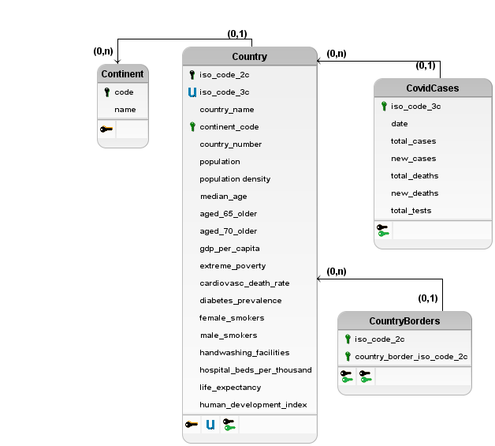

# Etapa Final

## Projeto `Covid-19 - Análise socioeconômica na pandemia`

## Equipe `Grupo Genérico de BD`
* `Lucas Fernandes André        RA: 182495`
* `Gabriel Massuyoshi Sato      RA: 172278`
* `Caio Lucas Silveira De Sousa RA: 165461`

## Slides da Apresentação da Etapa Final

> Apresentação: [Link](slides/apresentacao.pdf)

## Resumo do Projeto
A partir dos dados diversos de diferentes países, será analisado os dados socioeconômicos, localização geográfica, e de transmissão pelo Covid-19 de determinados países para conseguirmos conclusões do quanto as diferentes características de vida de um país, e fronteiras com outros países pode impactar a contaminação de sua população, número de mortes, etc.

## Motivação e Contexto

Sendo que o ano de 2020 foi um ano atípico, em que a população global vem sofrendo com uma epidemia que ainda está deixando vítimas por todos os lugares, não há um assunto mais comentado que poderia ser abordado para este estudo.  
Com isso, foi decidido o tema: Covid-19 - Análise socioeconômica na pandemia.    Dado que transmissão e mortes pelo Covid-19 estão crescendo no Brasil, surgiu a curiosidade de saber esses números em outros países, e se esses números de casos e mortes poderiam estar associados a questões socioeconômicas, e o quanto esses fatores são importantes, como por exemplo o IDH do país.  
Algumas expectativas sobre as análises a serem mostradas foram criadas, levando em conta as notícias sobre a doença ao redor do mundo:
* Espera-se um número de letalidade maior entre países com IDH baixo;
* Países que possuem maior quantidade de fronteiras tem um nível maior de contágio;
* Países vizinhos possuem níveis de contágio parecidos.

## Detalhamento do Projeto
> Apresente aqui detalhes da análise. Nesta seção ou na seção de Resultados podem aparecer destaques de código como indicado a seguir. Note que foi usada uma técnica de highlight de código, que envolve colocar o nome da linguagem na abertura de um trecho com `~~~`, tal como `~~~python`.
> Os destaques de código devem ser trechos pequenos de poucas linhas, que estejam diretamente ligados a alguma explicação. Não utilize trechos extensos de código. Se algum código funcionar online (tal como um Jupyter Notebook), aqui pode haver links. No caso do Jupyter, preferencialmente para o Binder abrindo diretamente o notebook em questão.

~~~python
df = pd.read_excel("/content/drive/My Drive/Colab Notebooks/dataset.xlsx");
sns.set(color_codes=True);
sns.distplot(df.Hemoglobin);
plt.show();
~~~

## Evolução do Projeto

Inicialmente começamos com a ideia de realizar análises mais pontuais e específicas de um país (Taiwan) com seus indicadores socioeconômicos e compará-las com o mundo. Após o estágio 2, entendemos que seria melhor abranger mais as análises, por conta das informações iniciais que tínhamos coletado e decidimos fazer um estudo sobre o contágio e mortalidade no mundo.
No decorrer do projeto, nos deparamos com a carência de dados para a análise, visto que a base de dados principal possuía muitas informações concentradas em somente uma tabela. A fim de explorar mais as técnicas de banco de dados, conversamos com o professor e ele sugeriu que fizéssemos uma análise geográfica em conjunto a socioeconômica. Depois de algumas pesquisas, decidimos adicionar bases de dados sobre fronteiras como indicador geográfico da análise. 
Adicionando mais bases de dados ao projeto, vimos a necessidade de alterar os modelos lógicos e relacionais, criando entidades que não existiam antes e adicionando dados a entidades para poderem se relacionar. Durante a reformulação dos modelos, percebemos que estávamos no caminho certo, já que os estudos que foram propostos estavam fazendo mais sentido para o grupo.
Após algumas reuniões para discussão das análises finais que seriam feitas, conseguimos integrar os indicadores geográficos aos dados sobre COVID-19 em três análises apresentadas na etapa final. Com os resultados das queries e grafos criados, fomos às notícias sobre COVID-19 no mundo para entender melhor qual o significado dos estudos feitos e se eles correspondiam às nossas expectativas.
Com todo o trabalho concluído, aprendemos que a ciência de dados é algo muito complexo e que necessita de muitos fatores e indicadores para se realizar algum estudo e análise coerente. Apesar de utilizarmos bastante dados, o tema que escolhemos demandaria várias outras informações, como rotas de voos e relatório sobre as testagens que ocorrem dentro de cada país para termos análises mais valiosas.
Algumas dificuldades encontradas foram em relação às bases de dados, no caso o de tabelas, em que diversas linhas ou colunas estavam faltando informações dos países, o que dificultou muito o trabalho para usar o modelo Relacional, devido a integridade dos dados ao fazer as queries em SQL. Para isso, foi necessário fazer um processamento nessas tabelas para remover essas inconsistências. Outro ponto de dificuldade foi o fato do notebook Jupyter estar H2 database engine, que não é o mais familiar para o grupo. Após pesquisas sobre alguns alter tables nessa engine conseguimos prosseguir. Somente após terminar as queries que descobrimos que a engine poderia ser facilmente alterada para, por exemplo, MySQL.

## Resultados e Discussão
> Apresente os resultados da forma mais rica possível, com gráficos e tabelas. Mesmo que o seu código rode online em um notebook, copie para esta parte a figura estática. A referência a código e links para execução online pode ser feita aqui ou na seção de detalhamento do projeto (o que for mais pertinente).
> A discussão dos resultados também pode ser feita aqui na medida em que os resultados são apresentados ou em seção independente. Aspectos importantes a serem discutidos: É possível tirar conclusões dos resultados? Quais? Há indicações de direções para estudo? São necessários trabalhos mais profundos?

## Conclusões
Ao começar o trabalho, tínhamos algumas hipóteses acerca da propagação do Covid e de sua taxa de mortalidade, sendo eles: Países que fazem fronteira um com o outro possuem número de casos semelhantes, dada sua proximidade; Países/Continentes com IDH menor apresentam taxa de mortalidade maior pelo vírus. Após as análises e resultados apresentados anteriormente, nota-se que países vizinhos não possuem casos semelhantes e que há uma tendência a países com muitas fronteiras terem um maior número de casos (Com exceção dos EUA e Tanzânia, porém pode-se entender que os Estados Unidos são uma exceção dada a quantidade de voos internacionais que passam por seu território). Também notou-se que países com IDH reduzido apresentavam uma taxa de mortalidade ligeiramente menor que países com maior IDH, o que nos pareceu estranho, tal resultado pode ser fruto da falta de diagnóstico definitivo nos mortos e doentes, uma vez que muitas vezes os países não possuem recursos para tal.

## Modelo Conceitual Final
> 

## Modelos Lógicos Finais
> 

## Programa de extração e conversão de dados atualizado

> Coloque um link para o arquivo do notebook que executa a extração e conversão de dados. Ele estará dentro da pasta `notebook`. Se por alguma razão o código não for executável no Jupyter, coloque na pasta `src`. Se a extração e conversão envolverem queries executadas através de uma interface de um SGBD não executável no Jupyter, como o Cypher, apresente na forma de markdown.

## Conjunto de queries para todos os modelos
> Notebook com as queries utilizadas no projeto final: [Link](notebooks/queries.ipynb)

> Markdown com as queries em Cypher utilizadas no projeto: [Link](./src/queriesCypher.md)

> Notebook com as queries da Etapa 3: [Link](../stage03/notebook/queries.ipynb)

> Acrescente um link para o(s) arquivo(s) do(s) notebook(s) que executa(m) as queries para cada um dos modelos lógicos. Eles estarão dentro da pasta `notebook`. Se por alguma razão o código não for executável no Jupyter, coloque na pasta `src`. Se as queries forem executadas através de uma interface de um SGBD não executável no Jupyter, como o Cypher, apresente na forma de markdown.
> Apresente todas as suas queries em versão final, mesmo que tenham aparecido em etapas anteriores.

## Bases de Dados

título da base | link | breve descrição
----- | ----- | -----
`Data on COVID-19 (coronavirus) by Our World in Data` | https://github.com/owid/covid-19-data/tree/master/public/data |  `Dados globais que analisam diversas características da população de um determinado país, como renda, expectativa de vida, etc.`
`Country Borders` | https://github.com/geodatasource/country-borders | `Mostra as fronteiras dos países`
`Country and Continent Codes List` | https://datahub.io/JohnSnowLabs/country-and-continent-codes-list | `Mostra países e qual continente eles pertencem`
`List of continent codes` | https://datahub.io/core/continent-codes | `Continentes e seus respectivos códigos`
`againstcovid19 - Taiwan - Cases` | https://againstcovid19.com/taiwan/cases | `Relação de casos de Taiwan baseado em relações de pessoas, em que cada nó é uma pessoa e cada aresta é o tipo de relação entre as pessoas`
`Dados socioeconômicos de Taiwan` | https://eng.stat.gov.tw/mp.asp?mp=5 | `Database relacionado aos dados socioeconômicos de Taiwan.`

## Arquivos de Dados

nome do arquivo | link | breve descrição
----- | ----- | -----
`owid-covid-data.csv` | [link](data/externo/owid-covid-data.csv) | `Dados do covid-19 em diversos países`
`GEODATASOURCE-COUNTRY-BORDERS.csv` | [link](data/externo/GEODATASOURCE-COUNTRY-BORDERS.csv) | `Mostra países que fazem fronteira entre si`
`country-and-continent-codes-list-csv_csv.csv` | [link](data/externo/country-and-continent-codes-list-csv_csv.csv) | `Mostra os códigos de duas e três letras dos países e seus continentes.`
`continent-codes_csv` | [link](data/externo/continent-codes_csv.csv) | `Códigos e nomes dos continentes do mundo`
`owid-country-data.csv`| [link](data/processado/owid-country-data.csv) | `Processado:  Dados de países como população, idh, etc. retirado originalmente de owid-covid-data.csv`
`casos-mortes-Continentes.csv` | [link](data/processado/casos-mortes-Continentes.csv) | `Processado: Mostra mortes e casos dos continentes`
`idh-mortes_casos_total.csv` | [link](data/processado/idh-mortes_casos_total.csv) | `Processado: Mostra mortes e casos por faixa de IDH`
`iso_2c_cases.csv` | [link](data/processado/iso_2c_cases.csv) | `Processado: Utilizado para visualização no Cytoscape`
`page-rank-borders.csv` | [link](data/processado/page-rank-borders.csv) | `Processado: Page Rank da quantidade de fronteiras que cada país possui`
