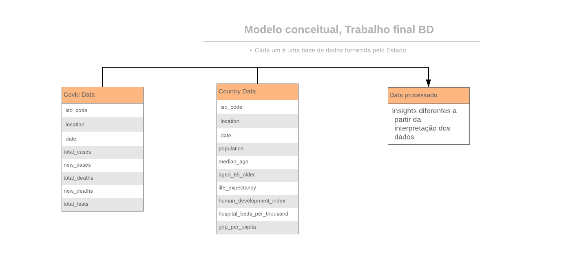

# Etapa 03 - Análises com o Primeiro Modelo Lógico

## Primeiro Modelo Conceitual

> 

## Primeiros Modelos Lógicos

## Primeiro conjunto de queries

> Queries em SQL: [Link](./notebook/queries.ipynb)

## Bases de Dados
título da base | link | breve descrição
----- | ----- | -----
`Data on COVID-19 (coronavirus) by Our World in Data` | https://github.com/owid/covid-19-data/tree/master/public/data` | Dados globais que analisam diversas características da população de um determinado país, como renda, expectativa de vida, etc.

## Arquivos de Dados
nome do arquivo | link | breve descrição
----- | ----- | -----
`owid-covid-data.csv` | [Link](data/owid-covid-data.csv) | Dados de covid-19 em diversos países
`owid-country-data.csv` | [Link](data/processado/owid-country-data.csv) | Arquivo processado obtido a partir do owid-covid-data.csv
