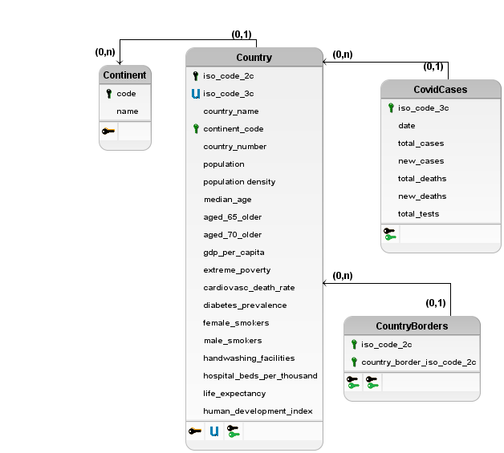

# Etapa 04 - Análises com o Segundo Modelo Lógico

## Slides da Apresentação da Etapa

> Apresentação: [Link](./slides/apresentacao.pdf)

## Modelo Conceitual Atualizado

> 

## Modelos Lógicos Atualizados

> 

## Conjunto de queries de dois modelos

> Queries em SQL: [Link](./notebook/queries.ipynb)

> Queries em Cypher: [Link](./src/queriesCypher.md)

> Queries em SQL da Etapa 3: [Link](../stage3/notebook/queries.ipynb)

## Bases de Dados

título da base | link | breve descrição
----- | ----- | -----
`Data on COVID-19 (coronavirus) by Our World in Data` | https://github.com/owid/covid-19-data/tree/master/public/data` |  `Dados globais que analisam diversas características da população de um determinado país, como renda, expectativa de vida, etc.`
`Country Borders` | https://github.com/geodatasource/country-borders | `Mostra as fronteiras dos países`
`Country and Continent Codes List` | https://datahub.io/JohnSnowLabs/country-and-continent-codes-list | `Mostra países e qual continente eles pertencem`

## Arquivos de Dados

nome do arquivo | link | breve descrição
----- | ----- | -----
`owid-covid-data.csv` | [Link](./data/owid-covid-data.csv) | `Dados do covid-19 em diversos países`
`owid-country-data.csv`| [Link](./data/owid-country-data.csv) | `Dados de países como população, idh, etc.`
`GEODATASOURCE-COUNTRY-BORDERS.csv` | [Link](./data/GEODATASOURCE-COUNTRY-BORDERS.csv) | `Mostra países que fazem fronteira`
`country-and-continent-codes-list-csv_csv.csv` | [Link](./data/country-and-continent-codes-list-csv_csv.csv) | `Mostra os códigos de duas e três letras dos países e seus continentes.`
`casos-mortes-Continentes.csv` | [Link](./data/processado/casos-mortes-Continentes.csv) | `Processado: Mostra mortes e casos dos continentes`
`idh-mortes_casos_total.csv` | [Link](./data/processado/idh-mortes_casos_total.csv) | `Processado: Mostra mortes e casos por faixa de IDH`

