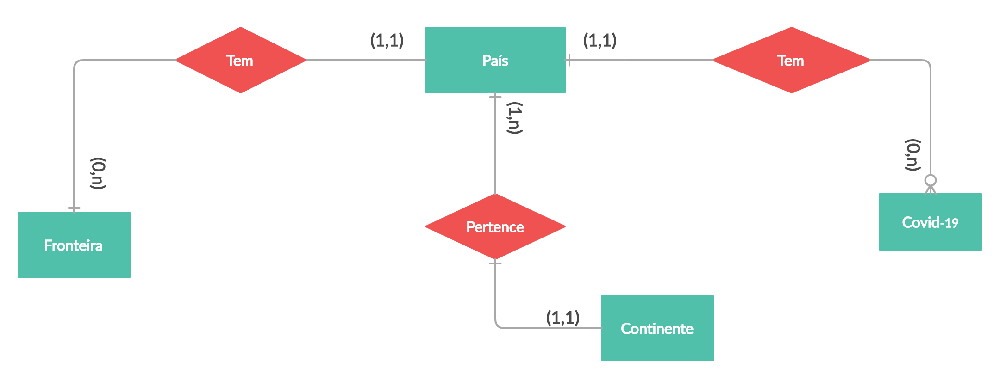

# Etapa 04 - Análises com o Segundo Modelo Lógico

## Slides da Apresentação da Etapa

> Coloque um link para o arquivo dos slides da apresentação que estão na pasta `slides`.

## Modelo Conceitual Atualizado

> Coloque aqui a imagem do modelo conceitual atualizado em ER ou UML, como o exemplo a seguir:
> 

## Modelos Lógicos Atualizados

> Coloque aqui os dois modelos lógicos dos bancos de dados relacionados aos modelos conceituais. O modelo lógico da etapa anterior pode ser copiado ou apresentado revisado. Para o modelo relacional, sugere-se o formato a seguir. Para outros modelos lógicos o formato é livre, pode ser adotado aqueles apresentados em sala.

> Exemplo de modelo lógico relacional
~~~
PESSOA(_Código_, Nome, Telefone)
ARMÁRIO(_Código_, Tamanho, Ocupante)
  Ocupante chave estrangeira -> PESSOA(Código)
~~~

## Programa de extração e conversão de dados atualizado

> Coloque um link para o arquivo do notebook que executa a extração e conversão de dados. Ele estará dentro da pasta `notebook`. Se por alguma razão o código não for executável no Jupyter, coloque na pasta `src`. Se a extração e conversão envolverem queries executadas atraves de uma interface de um SGBD não executável no Jupyter, como o Cypher, apresente na forma de markdown.

## Conjunto de queries de dois modelos

> Acrescente um link para o arquivo do notebook que executa o segundo conjunto de queries. Ele estará dentro da pasta `notebook`. Se por alguma razão o código não for executável no Jupyter, coloque na pasta `src`. Se as queries forem executadas atraves de uma interface de um SGBD não executável no Jupyter, como o Cypher, apresente na forma de markdown.
> O link para queries da etapa 3 também deve aparecer aqui e as queries poderão ser revisadas.

> Queries em SQL: [Link](./notebook/queries.ipynb)

> Queries em Cypher: [Link](./src/queriesCypher.md)

> Queries em SQL da Etapa 3: [Link](../stage3/notebook/queries.ipynb)

## Bases de Dados
> Elencar as bases de dados utilizadas no projeto. Trata-se de uma atualização daquelas apresentadas na Etapa 3.

título da base | link | breve descrição
----- | ----- | -----
`Country Borders` | https://github.com/geodatasource/country-borders | `Mostra as fronteiras dos países`
`Country and Continent Codes List` | https://datahub.io/JohnSnowLabs/country-and-continent-codes-list | `Mostra países e qual continente eles pertencem`

## Arquivos de Dados
> Elencar os arquivos usados no projeto que estão disponíveis no Github do projeto (manter os da Etapa 3 e acrescentar os da Etapa 4).

nome do arquivo | link | breve descrição
----- | ----- | -----
`<nome do arquivo>` | `<link para o arquivo>` | `<breve descrição do arquivo>`

> Os arquivos devem ser colocados na pasta `data`, em subpasta conforme seu papel (externo, interim, processado, raw). A diferença entre externo e raw é que o raw é em formato não adaptado para uso. A pasta `raw` é opcional, pois pode ser substituída pelo link para a base original da seção anterior.
> Coloque arquivos relacionais (usualmente CSV), XML ou JSON que não estejam disponíveis online e sejam acessados pelo notebook.
